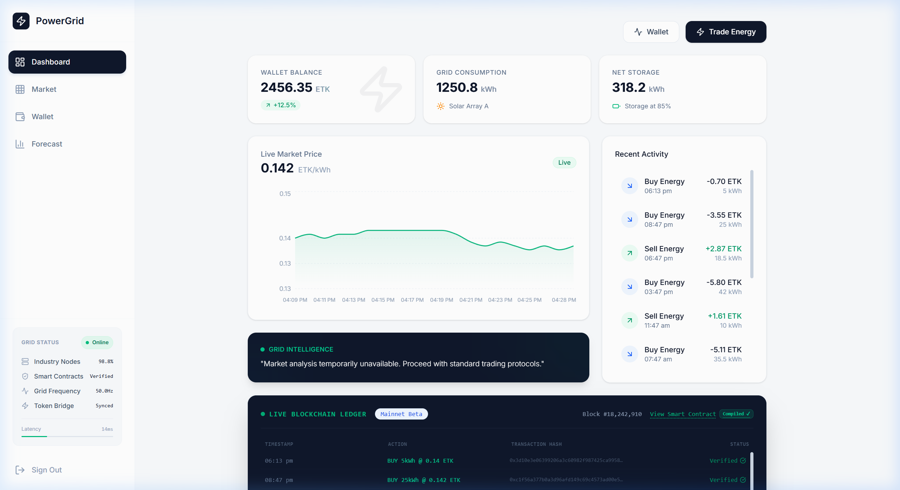
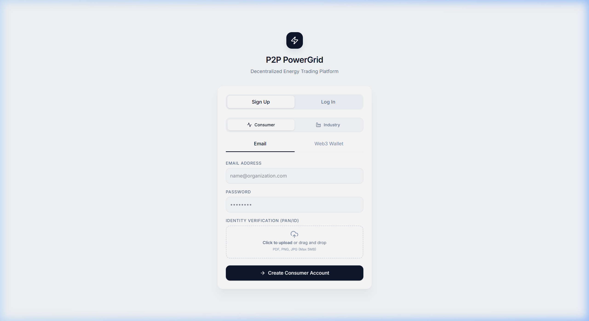
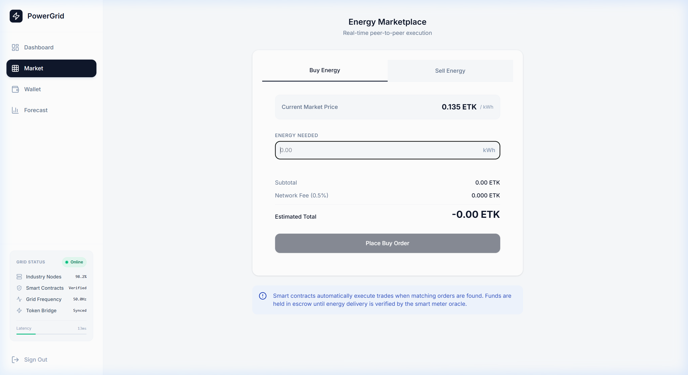
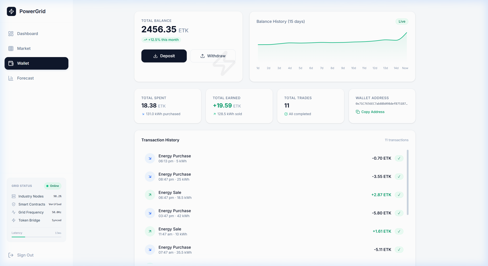
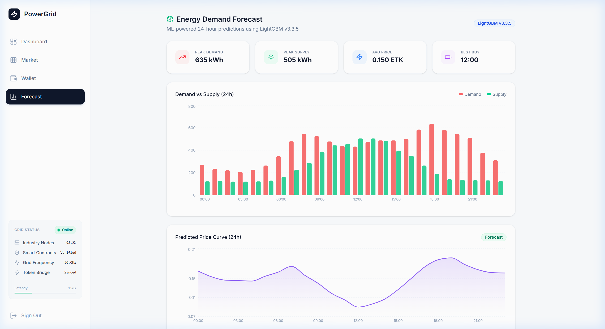

# ⚡ P2P PowerGrid

> A decentralized peer-to-peer energy trading platform built with Next.js 15, Turso, Solidity smart contracts, and AI-powered insights.

Consumers and prosumers can buy and sell renewable energy directly on a transparent marketplace with blockchain-verified transactions, real-time pricing, and ML-powered demand forecasting.

<<<<<<< HEAD

# ⚡ P2P PowerGrid

> A decentralized peer-to-peer energy trading platform built with Next.js 15, Turso, Solidity smart contracts, and AI-powered insights.

Consumers and prosumers can buy and sell renewable energy directly on a transparent marketplace with blockchain-verified transactions, real-time pricing, and ML-powered demand forecasting.

=======

>>>>>>> 63aa5f9 (refactor: flatten project structure + add Quick Demo Login button)

---

## ✨ Features

### Core
- **Live Energy Trading** — Buy and sell energy with real-time pricing and MetaMask-style transaction signing
- **Blockchain Ledger** — Transparent trade history with Solidity smart contracts (EnergyTrading.sol + EnergyToken.sol)
- **AI Market Insights** — Google Gemini-powered analysis of grid conditions and trading recommendations
- **ML Forecasting** — Time-seeded 24-hour demand, supply, and price predictions (changes daily)
- **Wallet Management** — Balance history chart, portfolio breakdown, and transaction history

### Security & Code Quality
- **JWT Authentication** — Secure signup/login with bcrypt password hashing
- **Atomic DB Transactions** — Trade operations use `db.batch()` for rollback safety
- **Input Validation** — Server-side validation on all trade parameters (type, amount, price)
- **JWT Expiry Check** — Client-side token expiry detection with auto-logout
- **Error Boundary** — Graceful error fallback UI for render crashes
- **Production JWT Enforcement** — Throws at startup if `JWT_SECRET` is missing in production

### UX Polish
- **Animated Numbers** — Smooth count-up animations on stat cards
- **Skeleton Loading** — Shimmer loading states while data is being fetched
- **Page Transitions** — Fade + slide animations between routes
- **Hover Effects** — Interactive stat cards with colored accent borders
- **Custom 404 Page** — Themed "node decommissioned" error page

---

## 📸 Screenshots

<details>
<summary>Click to expand all screenshots</summary>

### Login


### Dashboard


### Market


### Wallet


### Forecast


</details>

---

## 🛠 Tech Stack

| Layer | Technology |
|---|---|
| **Framework** | Next.js 15 (App Router, Turbopack) |
| **Language** | TypeScript |
| **Database** | Turso (libSQL) — edge-ready, globally distributed |
| **Auth** | JWT + bcryptjs |
| **AI** | Google Gemini API |
| **Blockchain** | Solidity ^0.8.21, Hardhat v2, OpenZeppelin |
| **Charts** | Recharts |
| **Styling** | Tailwind CSS v4 |
| **Deployment** | Vercel |

---

## 🚀 Getting Started

### Prerequisites
- **Node.js 18+**
- [Turso](https://turso.tech) account (free tier available)
- [Google AI Studio](https://aistudio.google.com) API key (optional — for AI insights)

### Setup

```bash
# Clone the repository
git clone https://github.com/harsh-kumar-rai/P2P-Powergrid.git
cd P2P-Powergrid

# Install dependencies
npm install

# Copy environment variables
cp .env.example .env.local
# Edit .env.local with your Turso URL, auth token, JWT secret, and Gemini API key

# Seed the database
npm run seed

# Start development server
npm run dev
```

Open [http://localhost:3000](http://localhost:3000) — **demo account:** `demo@powergrid.io` / `demo123` (or use the **Quick Demo Login** button on the login page)

---

## 📁 Project Structure

```
P2P-Powergrid/
├── app/
│   ├── api/                    # REST API routes
│   │   ├── auth/login/         # POST — JWT authentication
│   │   ├── auth/signup/        # POST — user registration
│   │   ├── trade/              # POST — execute trade (atomic transaction)
│   │   ├── trades/             # GET  — trade history
│   │   ├── wallet/             # GET  — user balance
│   │   ├── stats/              # GET  — grid statistics
│   │   ├── market-price/       # GET  — live market price
│   │   ├── forecast/           # GET  — ML demand/supply/price forecast
│   │   ├── insight/            # GET  — AI-powered market insight
│   │   └── reset/              # POST — reset demo data
│   ├── (dashboard)/            # Protected dashboard pages
│   │   ├── dashboard/          # Stats, charts, AI insights, blockchain ledger
│   │   ├── market/             # Buy/sell energy marketplace
│   │   ├── wallet/             # Balance, history chart, transactions
│   │   └── forecast/           # ML-powered 24h predictions
│   ├── login/                  # Authentication page (with Quick Demo Login)
│   ├── not-found.tsx           # Custom 404 page
│   └── layout.tsx              # Root layout
├── components/
│   ├── ui/                     # Reusable UI primitives (Card, Badge, Button)
│   ├── layout/                 # NetworkStatus sidebar widget
│   ├── error-boundary.tsx      # React Error Boundary
│   └── page-transition.tsx     # Animated page transitions
├── contracts/
│   ├── EnergyToken.sol         # ERC-20 energy token
│   ├── EnergyTrading.sol       # Trade settlement smart contract
│   └── README.md               # Contract documentation
├── lib/
│   ├── api.ts                  # Frontend API client
│   ├── auth.ts                 # JWT sign/verify + production enforcement
│   ├── db.ts                   # Turso database client
│   ├── model-info.ts           # ML model metadata
│   ├── types.ts                # TypeScript interfaces
│   └── utils.ts                # Formatting, hashing, price generation
├── scripts/
│   ├── seed.ts                 # Database seed script
│   ├── deploy.js               # Hardhat contract deployment
│   └── api-test.js             # API integration tests (13 tests)
├── test/
│   └── EnergyTrading.test.js   # Smart contract unit tests (11 tests)
└── docs/
    └── screenshots/            # App screenshots for README
```

---

## 🔗 Smart Contracts

Two Solidity contracts govern the energy trading logic:

| Contract | Purpose |
|---|---|
| **EnergyToken.sol** | ERC-20 token (ETK) for energy credits |
| **EnergyTrading.sol** | Trade initiation, settlement, and access control |

```bash
# Compile contracts
npm run compile

# Run smart contract tests (11 tests)
npm run test:contracts
```

---

## 🧪 Testing

```bash
# Run all tests (contracts + API)
npm run test

# Smart contract tests only (Hardhat + Chai)
npm run test:contracts

# API integration tests only (13 tests)
npm run test:api       # requires dev server running
```

**Test coverage:**
- 11 smart contract tests — deployment, minting, transfers, trading, access control
- 13 API integration tests — auth, stats, forecast, market-price, protected routes, trade execution

---

## 🌐 Deployment (Vercel)

1. Push to GitHub
2. Import project in [Vercel](https://vercel.com)
3. Root directory: `.` (project root — no subdirectory needed)
4. Add environment variables:
   - `TURSO_DATABASE_URL`
   - `TURSO_AUTH_TOKEN`
   - `JWT_SECRET` (required — app will not start without it)
   - `GEMINI_API_KEY` (optional)
5. Deploy

---

## 📜 Available Scripts

| Script | Description |
|---|---|
| `npm run dev` | Start dev server (Turbopack) |
| `npm run build` | Production build |
| `npm run seed` | Seed database with demo data |
| `npm run compile` | Compile Solidity contracts |
| `npm run test` | Run all tests |
| `npm run test:contracts` | Smart contract tests |
| `npm run test:api` | API integration tests |
| `npm run deploy:sepolia` | Deploy contracts to Sepolia testnet |

---

## 📄 License

MIT

---

Built with ⚡ by [Harsh Kumar Rai](https://github.com/harsh-kumar-rai)
<<<<<<< HEAD

=======
>>>>>>> 63aa5f9 (refactor: flatten project structure + add Quick Demo Login button)
